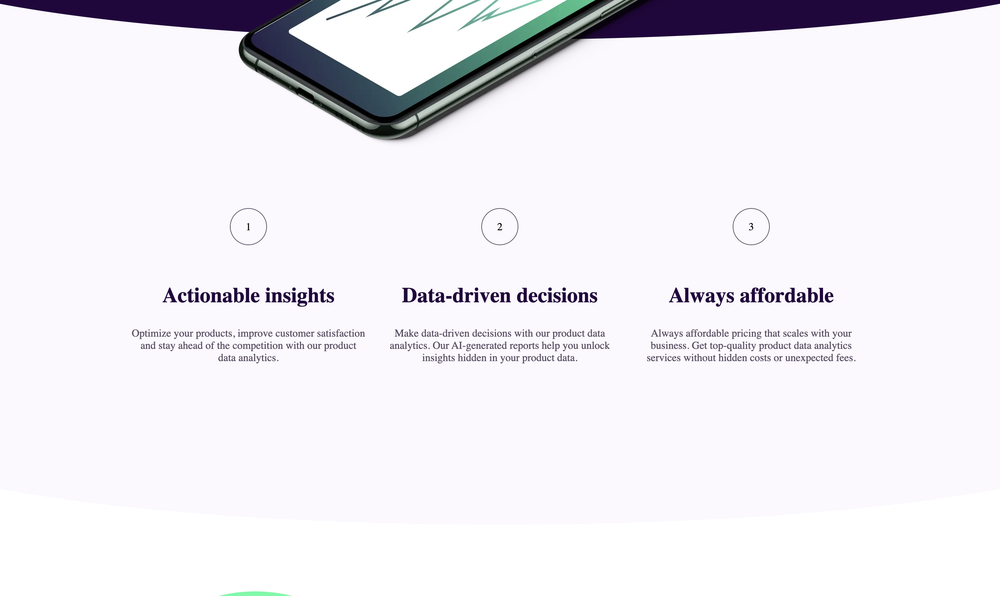
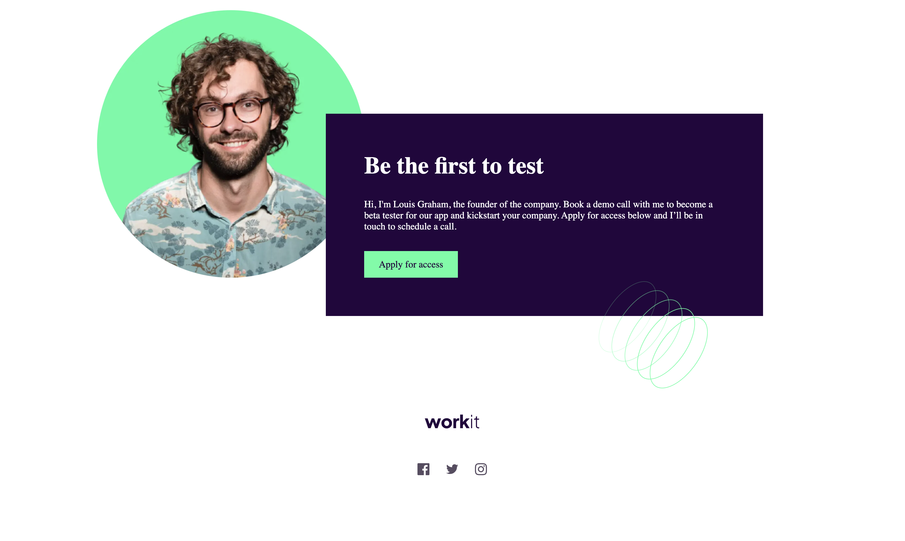

# Frontend Mentor - Workit landing page solution

This is a solution to the [Workit landing page challenge on Frontend Mentor](https://www.frontendmentor.io/challenges/workit-landing-page-2fYnyle5lu). Frontend Mentor challenges help you improve your coding skills by building realistic projects.

## Table of contents

- [Overview](#overview)
  - [The challenge](#the-challenge)
  - [Screenshot](#screenshot)
  - [Links](#links)
- [My process](#my-process)
  - [Built with](#built-with)
  - [What I learned](#what-i-learned)
  - [Continued development](#continued-development)
  - [Useful resources](#useful-resources)
- [Author](#author)
- [Acknowledgments](#acknowledgments)

## Overview

### The challenge

Users should be able to:

- View the optimal layout for the interface depending on their device's screen size
- See hover and focus states for all interactive elements on the page

### Screenshot






### Links

- Solution URL: [GitHub Repository](https://github.com/Qayyax/workit-landing-page)
- Live Site URL: [Deployed Site](workitlandingpage2.netlify.app)

## My process

### Built with

- Semantic HTML5 markup
- CSS custom properties
- Flexbox
- CSS positions

### What I learned

I learnt how to use the before and after pseudo element to make a curved bottom of a div, this was the most challenging part for me.

I need to work on using more of ems and rems as well as vw and % rather than using fixed units like px.

```css
.shape {
  position: relative;
  overflow: hidden;
  height: 80px;
  border: none;
}

.shape::before {
  border-radius: 100%;
  position: absolute;
  background: #24053e;
  right: -200px;
  left: -200px;
  top: -200px;
  content: '';
  bottom: 0;
  border: none;
}
```

### Continued development

I would like to continue working on more CSS projects as well as CSS animations, then adding functionality to my webpages with JavaScript.

## Author

- Website - [Abdulqayyum](https://github.com/Qayyax)
- Frontend Mentor - [@Qayyax](https://www.frontendmentor.io/profile/Qayyax)
- Twitter - [@qayyax](https://twitter.com/qayyax)

## Acknowledgments

I am grateful for the vast majority of resources online, which helped me learn HTML and CSS.
